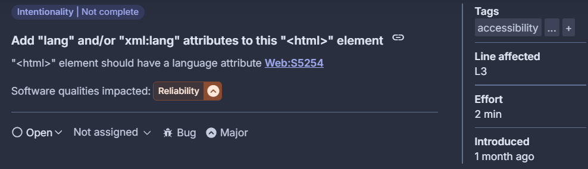

# Inspección de Código - Hito 5

## Herramienta usada: SonarCloud

Se ejecutó una inspección sobre los módulos críticos del proyecto, identificando problemas de seguridad y confiabilidad.

---

## Issue 1 – Security [E - Blocker]

**Archivo:** `contenido_view.py`  
**Línea afectada:** 31  
**Líneas relacionadas:** 23 y 29  

**Descripción:**  
Uso de ruta construida con datos controlados por el usuario (`image.name`), lo cual puede permitir ataques tipo *path traversal*. Esto ocurre cuando un archivo es guardado usando directamente su nombre original, sin sanitización.

**Captura:**

**Recomendación de SonarCloud:**  
Evitar usar directamente rutas derivadas de datos externos. Usar nombres aleatorios o controlados para almacenamiento de archivos.

**Acción tomada:**  
Modificar el código para generar un nombre de archivo aleatorio usando `uuid.uuid4()` y mantener la extensión original. Validar el tipo de archivo antes de guardar.

---

## Issue 2 – Reliability [C - Important]

**Archivo:** `crear_contenido.html`  
**Líneas afectadas:** 3 y 15  

**Descripción:**  
- Línea 3: falta especificar el idioma en el tag `<html>`, lo que puede causar errores de accesibilidad.  
- Línea 15: mal uso del bucle, asignando dentro del mismo, lo que puede llevar a errores lógicos.

**Captura:**

**Recomendación de SonarCloud:**  
- Declarar `lang="es"` en el documento HTML.
- Refactorizar la lógica del bucle.

**Acción tomada:**  
Actualizar el HTML con `lang="es"` y simplificar el bucle afectado

---

## Registro de Cambios

Esta información se encuentra en la carpeta `inspections/` del repositorio base.

- Se agregó el atributo `lang` a la etiqueta HTML para mejorar la accesibilidad y asegurar la correcta identificación del idioma por navegadores y tecnologías de asistencia.
- Se ajustaron los tamaños de los encabezados para mejorar la estructura del contenido y la accesibilidad para usuarios que utilizan lectores de pantalla.
- Se refactorizó la lógica de carga de imágenes para generar nombres de archivo únicos en cada imagen subida, evitando colisiones y sobrescrituras.
- Se limpiaron las declaraciones de importación para mejorar la organización y mantenibilidad del código.

### Commits asociados

- [`0a8958421a816852c41484bece9d264db66b56cc`](https://github.com/Bionic-Z/GRUPO04-2024-PROYINF/commit/0a8958421a816852c41484bece9d264db66b56cc): Add language attribute to HTML tag and adjust heading size for improved accessibility
- [`dc045876c3b563f49e07dd74438b386dd60a3379`](https://github.com/Bionic-Z/GRUPO04-2024-PROYINF/commit/dc045876c3b563f49e07dd74438b386dd60a3379): Refactor image upload logic to use unique filenames and clean up imports
