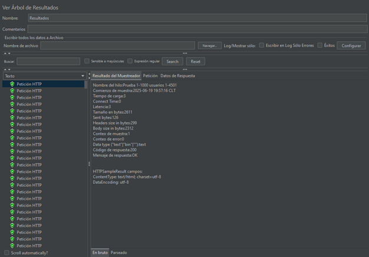
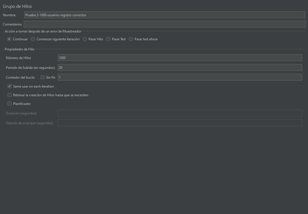
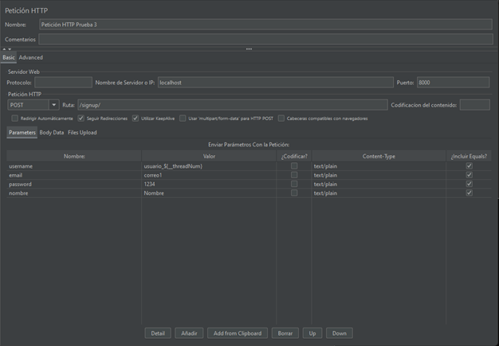

# Pruebas de Carga - Hito 5

## Herramienta usada: Apache JMeter

Se realizaron tres pruebas de carga en el proyecto, identificando posibles defectos en el sistema.

---

## Prueba 1: Prueba de carga sobre el endpoint /dashboard/ 
* Petición HTTP: GET
*	Cantidad de usuarios simulados: 5000

  

*	Condición esperada: El sistema responde en menos de 1 segundo (1000 ms) para cada usuario.
*	Resultados:

  

  
*	Presentación del gráfico:
  

  

  
*	Interpretación del gráfico (Tiempo de respuesta):

Media: 13 ms - Mediana: 4 ms - Mínimo: 3 ms - Máximo: 1246 ms
1.	El tiempo de respuesta medio es bastante bajo, con 13 ms, al igual que la mediana, con 4 ms, y el valor mínimo, con tan solo 3 ms, esto quiere decir que, en general, el sistema cumplió bastante bien la condición esperada, y que las peticiones fueron muy rápidas.
2.	Sin embargo, el tiempo de respuesta máximo fue de 1246 ms, lo que supera de gran manera el valor aceptable (1000 ms). En otras palabras, algunas peticiones no cumplieron la condición esperada.

* Análisis de resultados esperados:
  
A pesar de que en general los resultados indican valores aceptables (menores a 1 segundo), no es posible decir que el sistema cumple con la condición esperada, ya que existen respuestas que superan el valor aceptado. Esto nos ayuda a concluir que logramos una prueba válida, que nos muestra una amplia gama de resultados, como en un sistema real. 

Algunas razones por las que no se cumple siempre la condición esperada podrían relacionarse con una sobrecarga del servidor, o desincronización del endpoint.

## Prueba 2: Prueba de carga y funcionalidad sobre el endpoint /signup/ con registro correcto
* Petición HTTP: POST
*	Cantidad de usuarios simulados: 1000

  

*	Condición esperada: El sistema responde en menos de 1 segundo (1000 ms) para cada usuario.
*	Resultados:

  

  
*	Condición esperada: El sistema responde en menos de 1 segundo (1000 ms) para cada usuario.
*	Presentación del gráfico:

  

  
  
*	Interpretación del gráfico (Tiempo de respuesta):

Media: 13094 ms - Mediana: 7451 ms - Mínimo: 765 ms - Máximo: 65604 ms
1.	A pesar de que el tiempo de respuesta mínimo tiene un valor de 765 ms y cumple con la condición de ser menor a 1000 ms, ninguna otra medición la cumple, incluso el promedio se aleja bastante, con un valor de 13094 ms, y el tiempo de respuesta máximo se aleja muchísimo más, con un valor de 65604 ms.
2.	Esto indica que la mayoría de las peticiones no cumplieron con la condición esperada

* Análisis de resultados esperados:

Se concluye que el sistema no cumple con la condición esperada, esto quiere decir que el sistema responde en tiempos mayores a 1 segundo (1000 ms) para cada usuario. Incluso, el tiempo de respuesta máximo supera 1 minuto, lo que indica que la carga no se está manejando correctamente en el endpoint /signup/.

Esto puede deberse a distintas causas, entre ellas, es posible que la base de datos tenga problemas al registrar a tantos usuarios a la vez, o que haya problemas de sincronización.

Además, es posible confirmar que esta prueba es fallida, lo que significa que es exitosa, ya que pudimos notar un defecto en nuestro sistema.

## Prueba 3: Prueba de carga y funcionalidad sobre el endpoint /signup/ con registro incorrecto
* Petición HTTP: POST
*	Cantidad de usuarios simulados: 1000

  

*	Condición esperada: El sistema responde en menos de 1 segundo (1000 ms) para cada usuario.
*	Resultados:

  

  
*	Condición esperada: El sistema responde en menos de 1 segundo (1000 ms) para cada usuario.
*	Presentación del gráfico:

  

  
  
*	Interpretación del gráfico (Tiempo de respuesta):

Media: 14 ms - Mediana: 14 ms - Mínimo: 11 ms - Máximo: 30 ms
1.	Vemos que todas las mediciones cumplen ampliamente con el valor aceptado (menor a 1000 ms), inclusive el tiempo de respuesta máximo cuenta con un valor bastante bajo, tan solo 30 ms, siendo el promedio 14 ms, y el valor mínimo 11 ms.
2.	La media y mediana tienen el mismo valor (tiempo de respuesta de 14 ms), esto quiere decir que el tiempo fue consistente para la mayoría de las peticiones, y que no hay valores outliers que se alejen de la muestra.

* Análisis de resultados esperados:

Es posible concluir que el sistema cumple con la condición esperada, y que responde a las peticiones erróneas de una forma rápida y estable. En otras palabras, se dice que esta prueba fue exitosa, y no detectó errores al registrarse incorrectamente. 

También, si comparamos con la prueba 2, podemos decir que una de las razones por las que el tiempo de respuesta de esta prueba es tan bajo es porque al registrarse incorrectamente no se debe realizar operaciones costosas, como inserciones en la base de datos. Asimismo, se puede notar que el problema con la prueba 2 no está en la validación de datos, ya que en esta prueba se realiza eficientemente, sino que el problema se encuentra en la parte de procesamiento.
